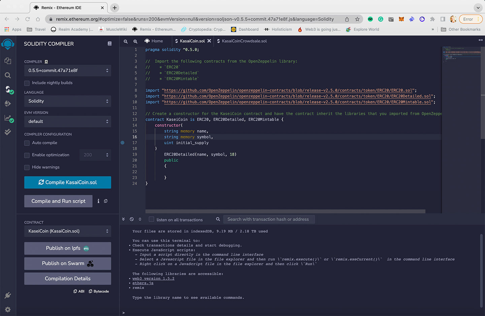
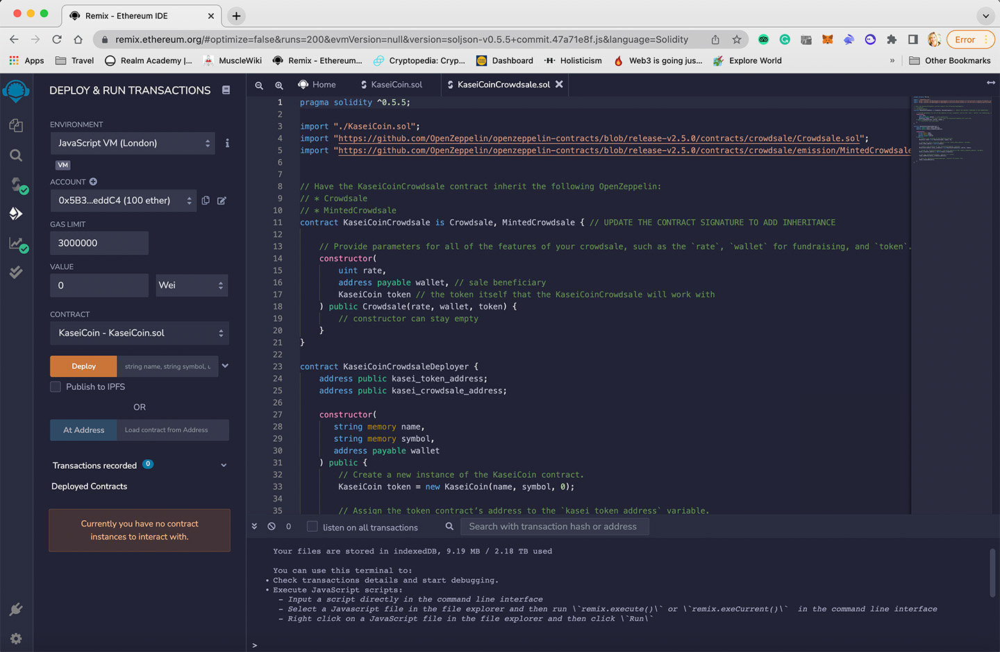
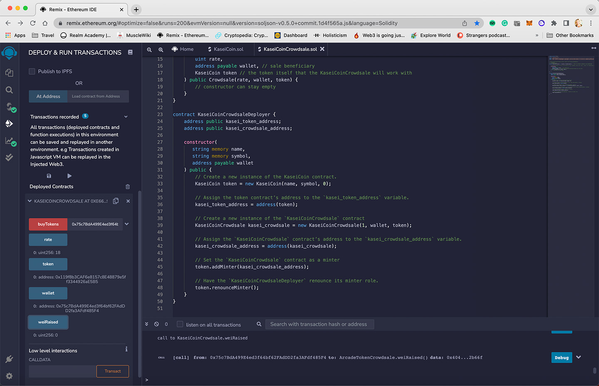
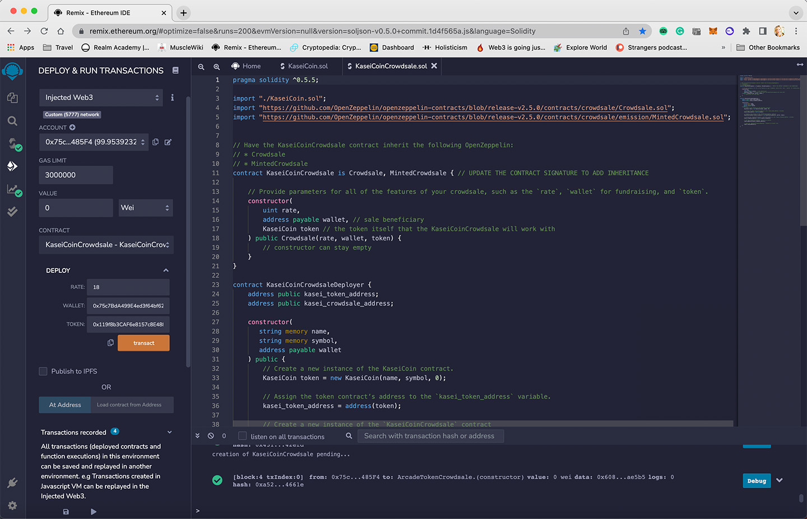
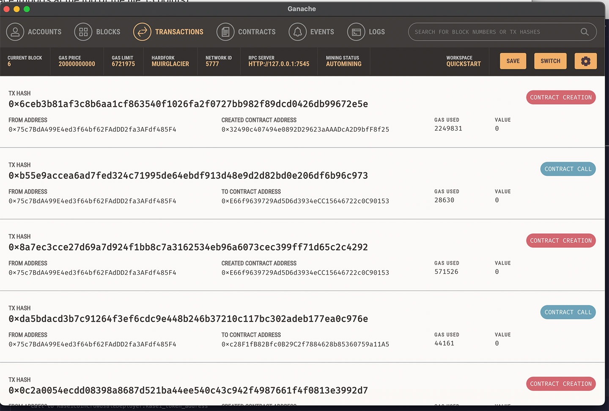
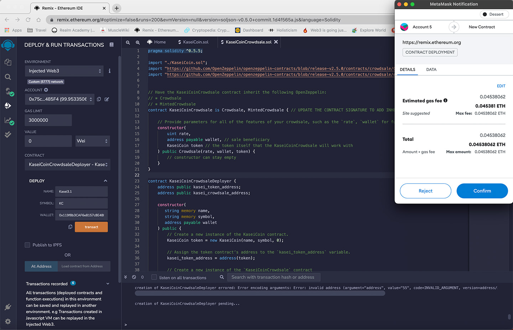
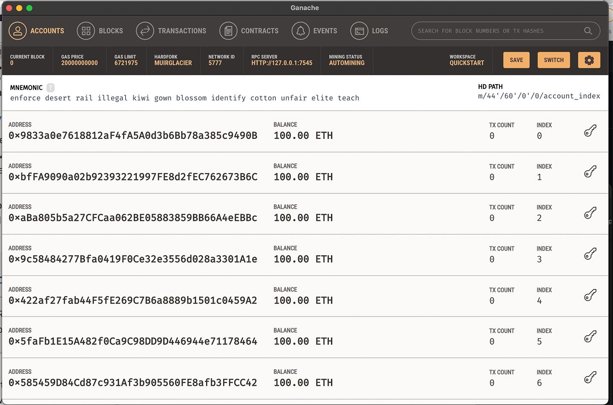
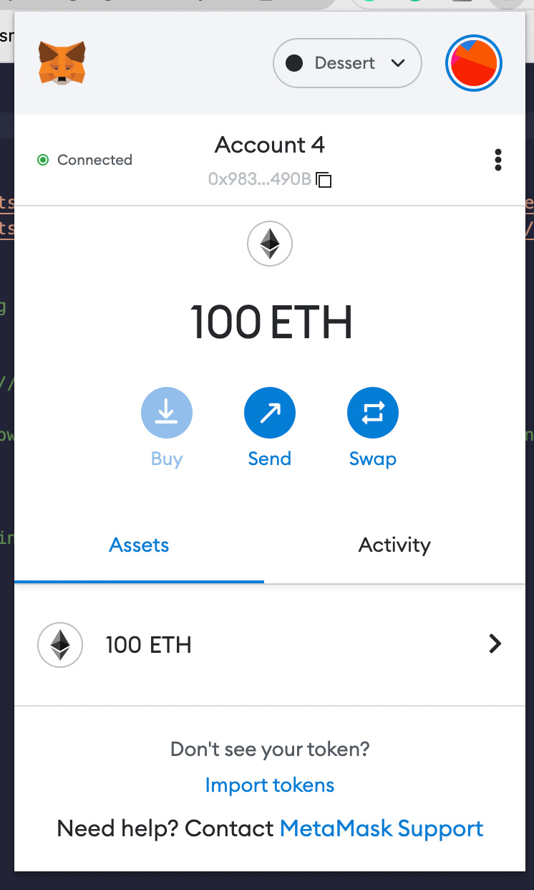

# Kasei Coin
---
 
After waiting for years and passing several tests, you were selected by the Martian Aerospace Agency to be part of the first human colony on Mars. As a prominent fintech professional, you were chosen to lead a project to develop a monetary system for the new Mars colony. You have decided to base this new monetary system on blockchain technology, and to define a new cryptocurrency called KaseiCoin. (“Kasei” means “Mars” in Japanese.)
  
KaseiCoin will be a fungible token that is ERC-20 compliant. You will launch a crowdsale that will allow people who are moving to Mars to convert their earthling money to KaseiCoin.

## Evaluation Evidence
### Creating and compiling the Kasei Token
 

### Creating and compiling the Kasei Crowdsale
 

### Deploying and transacting with the Crowdsale
 

### Crowdsale transactions
 

### Transactions on the local Blockchain Ganache
 

### Kasei Coin Deployer
 

### Local Test Blockchain
 

### Metamask Wallet for testing
 

## Technologies
<a href="https://soliditylang.org/">Solidity</a> 
<a href="http://remix.ethereum.org/">REMIX</a> 
<a href="https://trufflesuite.com/ganache/">Ganache</a> 
<a href="https://metamask.io">Metamask</a> 

## Contributor
Rachel Bates

## License
Creative Common
